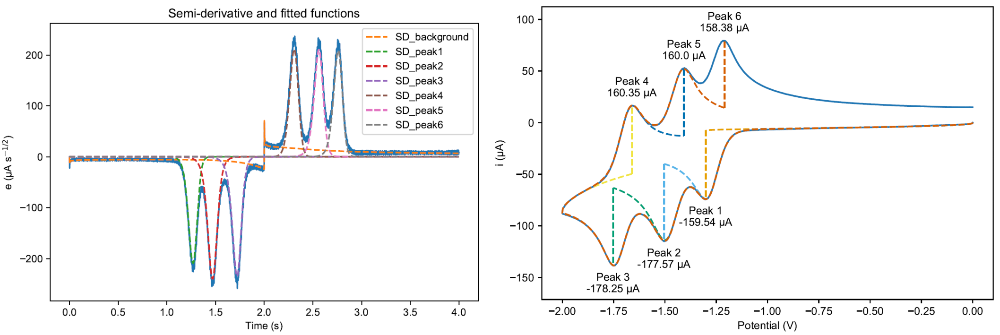

# SD-fitter

## Overview

This program uses semi-derivative transforms on cyclic voltammetry (CV) data to fit baselines for ip measurements. A summary PDF report is generated, with options for CSV and XLSX outputs to enable users to create their own plots. 

*Example of output plots from SD Fitter program. (Left) semi-derivative of voltammogram with individual fit components, and (right) voltammogram with baselines calculated using deconvolved fit components.*

A piecewise R-CPE model approximation is used to calculate the capactive current, and this is fitted at the same time as the Faradaic current components. Capacitive current fitting and exponential background electrolysis can be turned off. Exported data from CH Instruments, Nova, and PSTrace are currently supported. A template file is also available for users to input their own data manually.

## Basic usage

1. Download 'SD Fitter.exe', and optionally 'template.csv' from the 'Sample data' folder.

2. Open 'SD Fitter.exe'. Note that the executable can take some time to start when initially launched, but once the interface appears the program should be responsive.

3. Select your data format from the dropdown menu.

4. Use the 'Select CV file' button to select your text or CSV file, then the 'Select output folder' button to select a directory where the analysis output will be saved.
  
5. Select 'Run'. The program will generate a summary PDF in your designated output folder, along with any other selected outputs. A success message will appear if the program ran without errors. 

## CV data requirements

- IUPAC convention is assumed. Non-IUPAC voltammograms may still be processed but there will be issues with fitting capacitive current and background electrolysis.

- The voltammogram peaks should be resulting from linear diffusion control. This is required because the program uses semi-derivatives to transform the current data and expects symmetrical peak shapes. Using this program on voltammograms with semi-transient responses will likely give erroneous results.

- Fitting is performed in two steps, with an initial fit on a subset using a 50 mV window at the start, end, and 100 mV windows centred around switching potentials. For this reason the program may have issues fitting background current on voltammgrams with peaks too close to the switching potential.

- The capacitive current model assumes a wait time with E0 applied prior to the start of the potential sweep. This wait time helps prevent transient capacitive current decay resulting from the step change from EOCP to E0. Voltammograms measured without this wait time may still be processed, but this wait step is recommended where experimentally possible.

## Supported data formats
### Template CSV file
The CSV template can be used for data collected from any potentiostat. The user needs to input the experiment's scan rate (V/s), potential data (V), and current data (A) in a program like Excel. Take care when inputing data in scientific notation as some programs will round to three significant figures when the template copy is saved, resulting in current data with step artifacts. In Excel, formating these cells as 'General' should avoid this problem.

### CH Instruments text file
The exported data should be a text file with only the first two segments of your voltammogram. The program works with comma or tab delimited text files.

### Nova text file
Exports from Nova should use the following settings:  
  
File format: ASCII  
Write column headers: Yes  
Column delimiter: Comma (,)  
Decimal Separator: Period (.)  

### PSTrace CSV export
In PSTrace select 'Export data to CSV file...' under the 'Data' tab. This option in PSTrace will only export potential and current CV data, so the user will see an additional option pop up when running the program to input the experiment's scan rate. This input is used to calculate the time series data.

